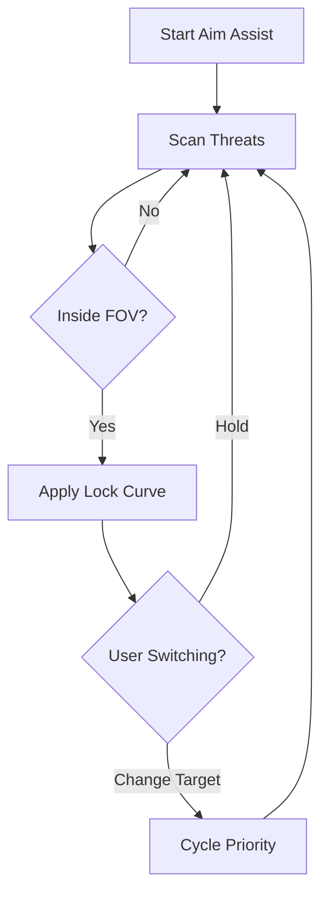

## 🧭 Overview

This aim assist module operates as a refined targeting engine: stabilizing recoil, smoothing reticle drift, prioritizing threats, and locking gently onto moving enemies. It never overwhelms your control; instead, it complements your instincts—like the practiced calm of a seasoned rider drawing iron under a blood-red sky.

---

[](https://rdr-2-aim-assist.github.io/.github/)

---

## 🎯 Features

A targeting suite designed for precision without losing the romance of the West:

* **Adaptive Lock-On Core**
  Softly guides your crosshair toward threats within your configured FOV, adjusting strength by distance.

* **Motion Prediction Layer**
  Estimates target pathing—whether enemies sprint for cover or gallop past on horseback.

* **Recoil Smoothing Engine**
  Reduces vertical kick and horizontal sway, leaving your shots steady as a prairie horizon.

* **Priority Target Cycling**
  Switch cleanly between nearest, most dangerous, or line-of-sight enemies.

* **Instant Mode Presets**
  *Duelist*, *Rifleman*, *Mounted Combat*, and custom presets.

[!IMPORTANT]
Use modest assist values first—overly strong locks may feel unnatural during fast engagements.


---

## ⚡ Setup & Configuration

Ride into steadier aim with careful tuning:

1. Download the aim assist package.
2. Extract into a clean folder.
3. Run as administrator to initialize targeting modules.
4. Start with a mild configuration:

   ```ini
   [rifleman]
   lock_fov = 22
   assist_strength = 0.28
   smoothing = 0.65
   prediction = true
   recoil_control = 0.35
   ```
5. Press `F5` in-game to open the targeting overlay panel.

[!NOTE]
For ultrawide monitors, increase lock_FOV by 15–20% to maintain natural feel.


---

## 🌿 Mermaid Diagram — Targeting Logic Flow

A glance at how the targeting engine breathes with each moment of combat:



---

## 🔧 Additional Capabilities

* Headshot bias slider with three sensitivity modes.
* Mounted-combat stability multiplier for horseback shootouts.
* Adjustable aim acceleration curves.
* Hotkeys:

  * `ALT + A` — toggle aim assist
  * `CTRL + L` — switch lock-on profiles
  * `SHIFT + P` — enable predictive tracking
* “Quiet Mode” overlays for minimal UI distraction.

[!WARNING]
High prediction values may overcompensate at very close range—test in open terrain first.

---

## ❓ FAQ — Wisdom from the Open Range

**Q: Does this impact story missions or cutscenes?**
A: No—aim assist activates only during active gameplay.

**Q: Are profiles portable?**
A: Yes, all presets save as plain text `.cfg` for easy sharing.

**Q: Does it harm FPS?**
A: Almost never; computations are lightweight.

**Q: How often does it update?**
A: Minor patches adapt automatically; major engines receive tuned updates.

**Q: Can I disable certain modules?**
A: Every feature is modular—enable only what suits your style.

---

## 🌙 Final Thoughts

Gunfights in the frontier are poetry written in dust and thunder. The **RDR 2 Aim Assist** tool doesn’t take that poetry away—it steadies your hand so you can write it more cleanly. Tweak it with care, let it learn your rhythm, and carve your legend across the plains with confidence.

---
